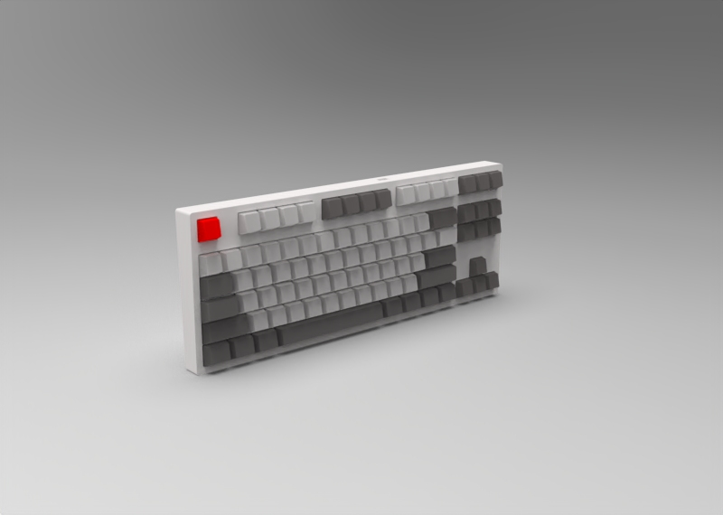
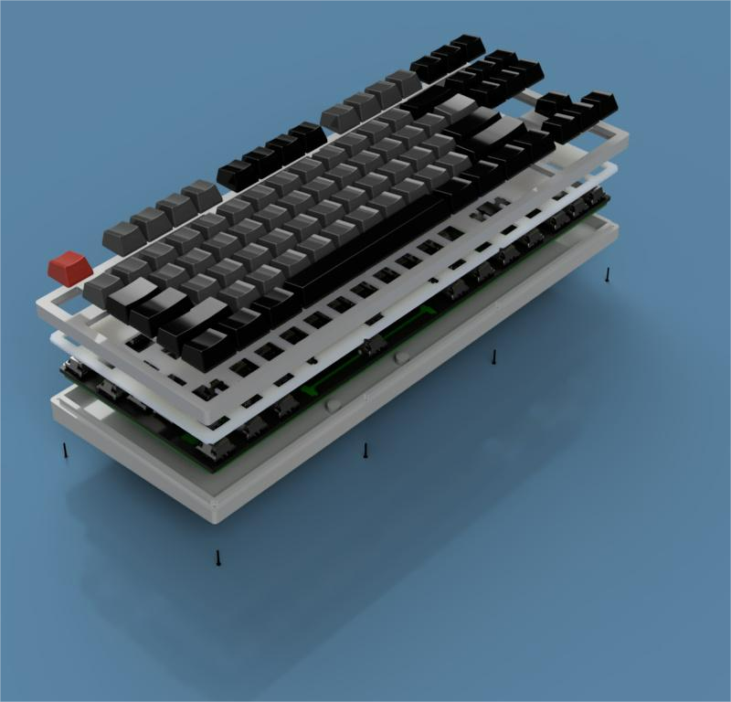

# usb_keyboard

一款全键无冲的usb2.0键盘

1, 硬件芯片采用了stm32f103系列芯片，通过SPI总线外挂了11个74HC165移位寄存器，采用了87按键布局方式，键盘布局生成方式可以通过以下两个网络去配置。http://www.keyboard-layout-editor.com/#/， http://builder.swillkb.com/

2, 3d外形图

采用了gasket结构， 包含了下壳, PCB, 轴下垫，定位板，上壳。

3，硬件方案参考：[peng-zhihui/HelloWord-Keyboard (github.com)](https://github.com/peng-zhihui/HelloWord-Keyboard)
